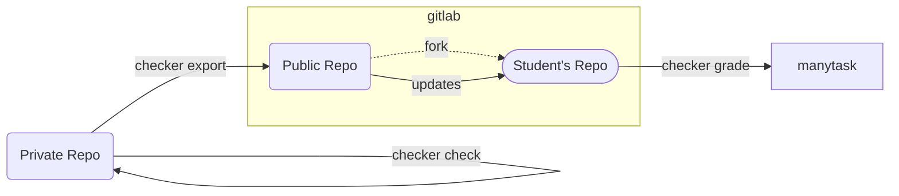

# Course Template for Manytask Checker


[](https://github.com/manytask/course-template/actions/workflows/test.yml)
[](https://github.com/manytask/course-template/actions/workflows/publish.yml)


This is an example of a programming course using [manytask](https://github.com/manytask/manytask) and [checker](https://github.com/manytask/checker).  
**Please refer to manytask and checker documentation first to understand the drill.**

In this example Python course will be used, but you can use any language you want, just need to change `.checker.yml` and `.docker` files (and tasks, of course).

Note: this course template assumes you hold private repo on GitHub and use GitHub-Actions to test and publish, so `.github/workflows` folder is used. If you want to hold it on GitLab, you will need to adapt and use `.gitlab-ci.private.yml` to test and publish you private code. 


## How it works

1. `manytask` - store and display deadlines and grades, create students' repos.
2. `checker` - test students' solutions against private and public tests, push scores to manytask.

* `private` - private repo with tasks, public/private tests and gold solutions.
* `public` - public repo with tasks, templates and public tests.




## Structure

Here is important files and folders listed:

```
├── .checker.yml    <- checker config - how to test, export files etc
├── .manytask.yml   <- course structure - task groups, tasks, deadlines - sent to manytask
│
├── .docker        <- docker image with testing environment
├── .dockerignore  <- dockerignore file - important to minimize image size
│
├── .github                  <- github-actions to run in private repo - test and publish to public repo
│   └── workflows
│       ├── publish.yml
│       └── test.yml
├── .gitlab-ci.private.yml   <- if using gitlab-ci in private repo
├── .gitlab-ci.yml           <- gitlab-ci to run in students' repos - test and push scores
│
├── 1.FirstGroup     <- groups with tasks, lectures and reviews
│   ├── .lecture
│   │   └── SampleLectureFile.ipynb
│   ├── .review
│   │   └── SampleReviewFile.ipynb
│   ├── hello_world
│   │   ├── .task.yml
│   │   ├── README.md
│   │   ├── __init__.py
│   │   ├── hello_world.py
│   │   └── test_public.py
│   └── sum_a_b/...
├── 2.SecondGroup/...
├── 3.ThirdGroup/...
│
├── README.md         <- readme with course description visible for students
├── pyproject.toml    <- public config with linters, typechecker, formatter etc configs
├── requirements.txt  <- public requirements with all stunedts' dependencies
├── tools             <- repository with some tools to help in testing, e.g. additional plugins for checker
│   └── plugins
│       └── run_pytest.py
```

## Installation

1. Install Self-Hosted GitLab or Create main group on GitLab.com
2. Install Self-Hosted GitLab runner and connect as a instance runner or shared group runner.
3. Create group for your course, enable shared runners. e.g. `gitlab.manytask.org/python`(self-hosted) or `gitlab.com/manytask/python` (global).
4. Create empty public repo for your this year of course, e.g. `.../python/public-2023-fall`.
5. Create PRIVATE group for students, e.g. `.../python/students-2023-fall/` (for students not to see other repos).
6. Setup [manytask](https://github.com/manytask/manytask).
7. Create private repository with tasks, public/private tests and solutions. Use this repo as a examples.
8. Setup private CI to run `checker check` on each push/mr and `checker export` on each push/mr or release or regularly or manually. Also add job to build and PRIVATELY publish docker with testenv and repo. 
9. Setup public CI to run `checker grade` on each push/mr.
10. Profit!